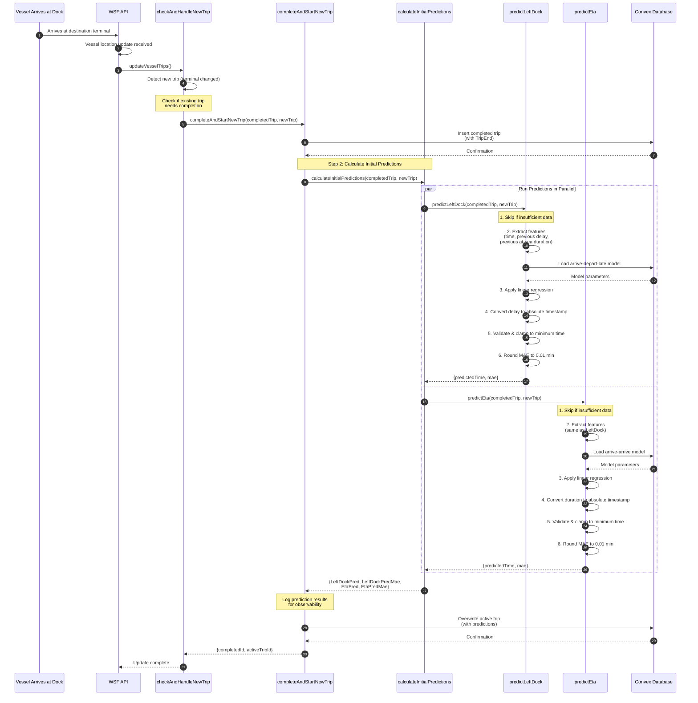
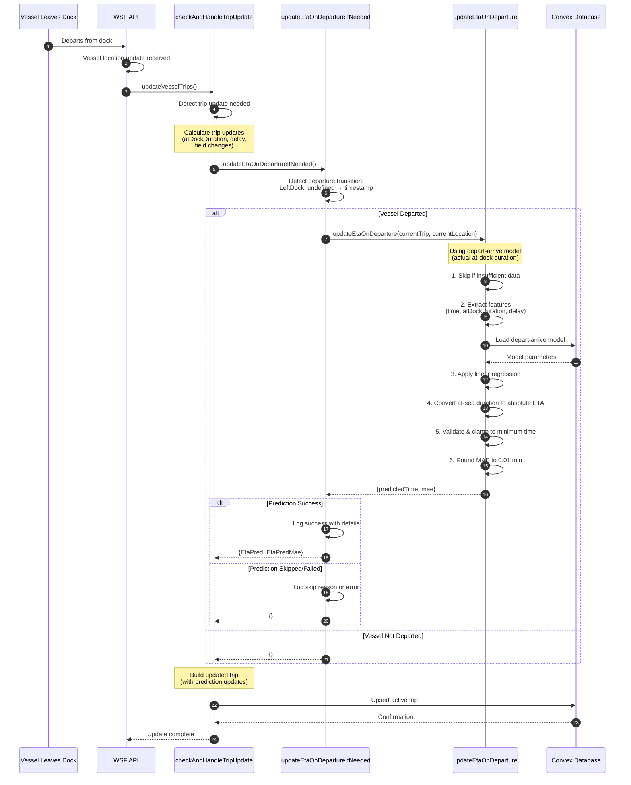

# ML Prediction Flow Sequence Diagram

This document describes the complete flow of ML predictions in the vessel tracking system, including timing and data flow for both initial predictions and departure updates.

## Overview

The prediction system makes predictions at two key moments:
1. **When a vessel arrives at dock and a new trip starts** - Initial predictions
2. **When a vessel leaves dock** - Updated ETA prediction

## Sequence Diagram: Initial Predictions



## Sequence Diagram: ETA Update on Departure



## Timing and Data Flow Details

### Initial Predictions Timing

```
Timestamp                  | Event
---------------------------|----------------------------------------------------
t1                         | Vessel arrives at destination dock (TripEnd)
                           | API receives location update
                           |
t1 + Δ1 (ms)               | Mutation: completeAndStartNewTrip called
                           | DB: Insert completed trip
                           |
t1 + Δ1 + Δ2 (ms)          | calculateInitialPredictions called
                           | Parallel execution:
                           |   - predictLeftDock starts
                           |   - predictEta starts
                           |
t1 + Δ1 + Δ2 + Δ3a (ms)   | predictLeftDock completes
                           |   - Feature extraction: ~1ms
                           |   - Model DB query: ~10-50ms
                           |   - Linear regression: <1ms
                           |   - Time conversion: <1ms
                           |   - Validation: <1ms
                           |
t1 + Δ1 + Δ2 + Δ3b (ms)   | predictEta completes
                           |   - Similar timing to predictLeftDock
                           |   - Total parallel time: ~10-50ms
                           |
t1 + Δ1 + Δ2 + Δ3 + Δ4    | DB: Overwrite active trip with predictions
                           |   (including LeftDockPred and EtaPred)
                           |
t1 + Δ1 + Δ2 + Δ3 + Δ4     | Mutation returns
                           | Total prediction overhead: ~15-60ms
```

**Key Notes:**
- Parallel execution reduces total prediction time
- DB query for model loading dominates latency
- Prediction calculation is sub-millisecond
- Total prediction overhead is typically <100ms

### ETA Update on Departure Timing

```
Timestamp                  | Event
---------------------------|----------------------------------------------------
t1                         | Vessel leaves dock (LeftDock set)
                           | API receives location update
                           |
t1 + Δ1 (ms)               | Action: updateVesselTrips called
                           | Detect trip update needed
                           |
t1 + Δ1 + Δ2 (ms)          | Calculate trip updates
                           | - atDockDuration calculated
                           | - Detect departure transition
                           |
t1 + Δ1 + Δ2 + Δ3 (ms)    | updateEtaOnDepartureIfNeeded called
                           | Vessel departure confirmed
                           |
t1 + Δ1 + Δ2 + Δ3 + Δ4    | updateEtaOnDeparture called
                           |   - Feature extraction: ~1ms
                           |   - Model DB query: ~10-50ms
                           |   - Linear regression: <1ms
                           |   - Time conversion: <1ms
                           |   - Validation: <1ms
                           |
t1 + Δ1 + Δ2 + Δ3 + Δ4    | DB: Upsert active trip with new EtaPred
                           |
t1 + Δ1 + Δ2 + Δ3 + Δ4     | Action returns
                           | Total prediction overhead: ~10-55ms
```

**Key Notes:**
- Only one prediction needed (not parallel)
- Same model loading latency as initial predictions
- Total prediction overhead is typically <60ms

## Data Flow Summary

### Data Flow: Initial Predictions

```
Input: Completed trip + New trip
  ↓
Feature Extraction:
  - Time features (from ScheduledDeparture)
  - Previous trip: Delay, AtSeaDuration
  - New trip: TripStart
  ↓
Model Loading (DB query):
  - arrive-depart-late model
  - arrive-arrive model
  ↓
Prediction Calculation:
  - Linear regression: y = intercept + Σ(coefficient × feature)
  ↓
Time Conversion:
  - LeftDock: TripStart + predictedDelay
  - ETA: TripStart + predictedCombinedDuration
  ↓
Validation:
  - Clamp to minimum: TripStart + 2 minutes
  ↓
MAE Rounding:
  - Round to 0.01 minutes
  ↓
Output:
  - LeftDockPred (absolute ms)
  - LeftDockPredMae (0.01 min precision)
  - EtaPred (absolute ms)
  - EtaPredMae (0.01 min precision)
```

### Data Flow: ETA Update on Departure

```
Input: Current trip + Current location
  ↓
Departure Detection:
  - LeftDock: undefined → timestamp
  - AtDockDuration calculated
  ↓
Feature Extraction:
  - Time features (from ScheduledDeparture)
  - Current trip: AtDockDuration, Delay
  ↓
Model Loading (DB query):
  - depart-arrive model
  ↓
Prediction Calculation:
  - Linear regression: y = intercept + Σ(coefficient × feature)
  ↓
Time Conversion:
  - ETA: LeftDock + predictedAtSeaDuration
  ↓
Validation:
  - Clamp to minimum: LeftDock + 2 minutes
  ↓
MAE Rounding:
  - Round to 0.01 minutes
  ↓
Output:
  - EtaPred (absolute ms) - updated
  - EtaPredMae (0.01 min precision) - updated
```

## Feature Engineering Details

### Time Features (All Predictions)

**Time-of-Day Features (8 Gaussian RBF centers):**
```typescript
time_center_0: exp(-((hour - 2)^2) / (2 * 3^2))   // 2 AM
time_center_1: exp(-((hour - 5)^2) / (2 * 3^2))   // 5 AM
time_center_2: exp(-((hour - 8)^2) / (2 * 3^2))   // 8 AM
time_center_3: exp(-((hour - 11)^2) / (2 * 3^2))  // 11 AM
time_center_4: exp(-((hour - 14)^2) / (2 * 3^2))  // 2 PM
time_center_5: exp(-((hour - 17)^2) / (2 * 3^2))  // 5 PM
time_center_6: exp(-((hour - 20)^2) / (2 * 3^2))  // 8 PM
time_center_7: exp(-((hour - 23)^2) / (2 * 3^2))  // 11 PM
```

**Weekend Feature:**
```typescript
isWeekend: 1 if dayOfWeek ∈ {0 (Sun), 6 (Sat)}, else 0
```

### Arrive-Depart-Late Features (LeftDock Prediction)

```typescript
{
  time_center_0...7,      // Time-of-day features (8)
  isWeekend,              // Weekend flag (1)
  prevDelay,              // Previous trip's delay (minutes)
  prevAtSeaDuration,      // Previous trip's at-sea duration (minutes)
  arriveBeforeMinutes,    // Time from arrival to scheduled departure (minutes)
}                        // Total: 12 features
```

**What it predicts:**
- Departure delay from scheduled departure time
- Model: `arrive-depart-late`
- Target: Delay (minutes from scheduled to actual departure)

### Arrive-Arrive Features (Initial ETA Prediction)

```typescript
{
  time_center_0...7,      // Time-of-day features (8)
  isWeekend,              // Weekend flag (1)
  prevDelay,              // Previous trip's delay (minutes)
  prevAtSeaDuration,      // Previous trip's at-sea duration (minutes)
  arriveBeforeMinutes,    // Time from arrival to scheduled departure (minutes)
}                        // Total: 12 features
```

**What it predicts:**
- Combined duration: at-dock + at-sea
- Model: `arrive-arrive`
- Target: Total duration from arrival to next arrival (minutes)

### Depart-Arrive Features (ETA Update on Departure)

```typescript
{
  time_center_0...7,      // Time-of-day features (8)
  isWeekend,              // Weekend flag (1)
  atDockDuration,         // Actual at-dock duration (minutes)
  delay,                  // Departure delay (minutes)
}                        // Total: 11 features
```

**What it predicts:**
- At-sea duration from departure to arrival
- Model: `depart-arrive`
- Target: At-sea duration (minutes)

## Model Types Summary

| Model Type              | Features | Predicts                         | Used For                    | When Called |
|-------------------------|----------|----------------------------------|-----------------------------|-------------|
| arrive-depart-late      | 12       | Departure delay                  | LeftDockPred                | Trip start  |
| arrive-arrive           | 12       | Combined duration (dock + sea)    | EtaPred (initial)           | Trip start  |
| depart-arrive           | 11       | At-sea duration                  | EtaPred (updated)           | Departure   |

## Error Handling and Logging

### Prediction Skip Reasons

Predictions are skipped when:

1. **Insufficient Context Data:**
   - Missing previous trip data (Delay, AtSeaDuration)
   - Missing new trip data (TripStart, ScheduledDeparture)
   - Missing current trip data (AtDockDuration, Delay, LeftDock)

2. **Model Not Found:**
   - No model trained for terminal pair
   - Model type not in database

3. **Invalid Model Parameters:**
   - Missing coefficients array
   - Missing intercept value

### Logging

All predictions are logged for observability:

```typescript
// Successful LeftDock prediction
console.log(`[ML Prediction] LeftDockPred calculated for ${vessel}:`, {
  vessel,
  departingTerminal,
  arrivingTerminal,
  scheduledDeparture,
  predictedLeftDock,
  leftDockMae,
});

// Successful ETA prediction
console.log(`[ML Prediction] EtaPred calculated for ${vessel}:`, {
  vessel,
  departingTerminal,
  arrivingTerminal,
  tripStart,
  predictedEta,
  etaMae,
});

// Successful ETA update on departure
console.log(`[ML Prediction] EtaPred updated on departure for ${vessel}:`, {
  vessel,
  departingTerminal,
  arrivingTerminal,
  leftDock,
  atDockDuration,
  delay,
  predictedEta,
  etaMae,
});

// Skipped predictions
console.log(`[ML Prediction] ${predictionType} skipped for ${vessel}:`, {
  vessel,
  reason: "Insufficient data or model not found",
});

// Failed predictions
console.error(`[ML Prediction] Failed to calculate ${predictionType} for ${vessel}:`, error);
```

## Performance Characteristics

### Prediction Timing

| Operation                          | Typical Time | Notes                              |
|------------------------------------|--------------|-------------------------------------|
| Feature extraction                  | ~1ms         | Pure computation                    |
| Model DB query                     | 10-50ms      | Dominant factor                     |
| Linear regression calculation        | <1ms         | Sub-millisecond                     |
| Time conversion                    | <1ms         | Simple arithmetic                   |
| Validation                        | <1ms         | Simple comparison                   |
| MAE rounding                      | <1ms         | Single math operation               |
| **Total (single prediction)**      | **10-55ms**  | DB query dominates                 |
| **Total (parallel predictions)**    | **15-60ms**  | Initial predictions only            |

### Concurrency

- **Initial Predictions:** Run in parallel (predictLeftDock + predictEta)
- **ETA Update:** Single prediction (updateEtaOnDeparture)
- **Vessel Updates:** Each vessel processed sequentially, but predictions are fast

### Database Impact

- **Model Loading:** One DB query per prediction type
- **Trip Updates:** One DB write per vessel location update
- **Prediction Storage:** No additional storage (predictions stored with trip)

## Validation and Clamping

### Minimum Time Constraints

All predictions are clamped to minimum valid times:

```typescript
const minimumValidTime = referenceTime + minimumGapMinutes * 60000;
const validatedTime = Math.max(predictedTime, minimumValidTime);
```

| Prediction Type   | Reference Time      | Minimum Gap | Use Case                           |
|-------------------|--------------------|-------------|------------------------------------|
| LeftDockPred      | TripStart          | 2 minutes   | Vessel must dock before departing  |
| EtaPred (initial) | TripStart          | 2 minutes   | Minimum trip duration               |
| EtaPred (update)  | LeftDock           | 2 minutes   | Minimum at-sea duration            |

### MAE Precision

All MAE values rounded to 0.01 minutes (0.6 seconds):

```typescript
const roundedMae = Math.round(mae * 100) / 100;
```

**Examples:**
- 3.456 min → 3.46 min
- 2.304 min → 2.30 min
- 1.005 min → 1.01 min

## Production Deployment Considerations

### Monitoring

Track these metrics in production:

1. **Prediction Success Rate:**
   - Percentage of predictions that succeed vs. are skipped
   - Break down by model type and terminal pair

2. **Prediction Latency:**
   - Average, p50, p95, p99 prediction times
   - Identify performance bottlenecks

3. **Prediction Accuracy:**
   - Use `validate-predictions.ts` script regularly
   - Track MAE over time
   - Compare predicted vs. actual times

4. **Model Availability:**
   - Percentage of terminal pairs with valid models
   - Identify gaps in model coverage

### Scaling

- **Model Loading Latency:** Consider caching models in memory if latency becomes an issue
- **Parallel Processing:** Initial predictions already run in parallel
- **Database Load:** Prediction queries are lightweight, but monitor during peak times

### Failures

- **Graceful Degradation:** System continues operating without predictions
- **Error Logging:** All failures logged with context
- **Alerting:** Consider alerts for low prediction success rates

