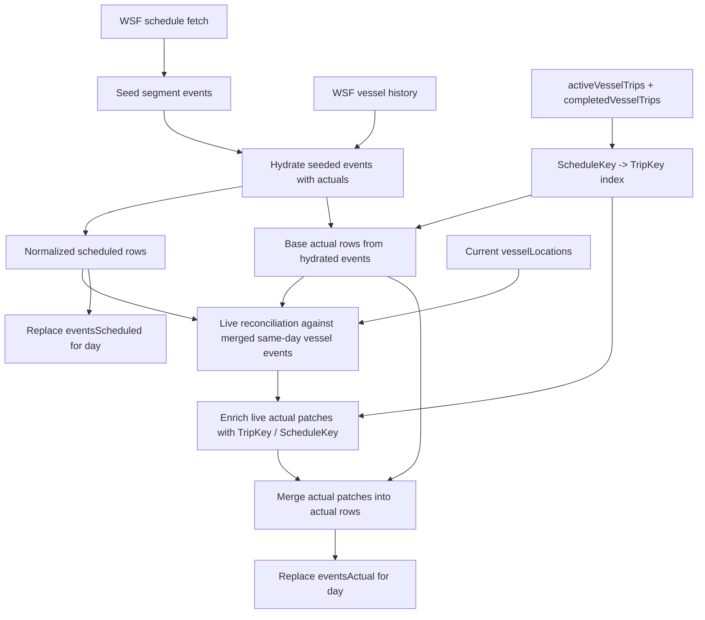

# Engineering Memo: VesselTimeline Reconciliation Path and Backend Concerns

Date prepared: 2026-04-14  
Audience: future backend engineer refactoring `vesselTimeline` module structure  
Scope: same-day VesselTimeline reseed/reconciliation pipeline, key semantics, current concerns, and concrete example walkthrough

## Purpose

This memo captures two things in one place:

1. the current backend reconciliation path for same-day `VesselTimeline` rebuilds
2. the concerns identified while reviewing the trip/timeline redesign work against the implementation

The goal is to make future `vesselTimeline` refactoring safer by documenting:

- which code paths are doing schedule matching vs physical identity binding
- which keys exist at each stage
- where live WSF data is reconciled against scheduled rows
- where the current implementation intentionally narrows or preserves behavior

## Bottom Line

The current reconciliation pipeline is structurally sound and already reflects the main redesign:

- `eventsScheduled` is still the structural backbone
- `eventsActual` is now persisted with physical identity:
  - `EventKey`
  - `TripKey`
  - optional `ScheduleKey`
- same-day rebuilds preserve already-stored physical-only actual rows
- backend timeline reads remain same-day and server-owned

The important architectural split is:

- schedule context is still used to decide what a live/history fact most likely aligns to
- physical identity is used when persisting `eventsActual`

That is the right overall direction.

## Main Concerns

### Concern 1: Departure actual projection previously relied on raw `LeftDock`

This was the stronger issue found in review.

The spec makes `LeftDockActual` the physical departure boundary, while `LeftDock`
still represents raw WSF input. The writer in
[convex/functions/vesselTrips/updates/projection/actualBoundaryPatchesFromTrip.ts](/Users/rob/code/ferryjoy/ferryjoy-client-neo/convex/functions/vesselTrips/updates/projection/actualBoundaryPatchesFromTrip.ts)
had been emitting departure actuals from `trip.LeftDock` only.

That has now been corrected to:

- prefer `LeftDockActual`
- fall back to `LeftDock`

Why this matters:

- `LeftDockActual` is the debounced physical lifecycle boundary
- `LeftDock` is still useful and should be preserved as raw WSF data
- projection should prefer the physical lifecycle boundary while still retaining
  fallback compatibility with WSF input

### Concern 2: Reseed reconciliation is still schedule-scoped

This concern is more nuanced.

The current reconciliation path still assumes that same-day rebuilds begin from
scheduled coverage. In
[convex/domain/vesselTimeline/events/reconcile.ts](/Users/rob/code/ferryjoy/ferryjoy-client-neo/convex/domain/vesselTimeline/events/reconcile.ts),
live-location reconciliation only runs for vessels that already have scheduled
rows for the day, and `TripKey` enrichment still depends on `SegmentKey`.

That means:

- already-stored physical-only actual rows are preserved during reseed
- but a physical-only fact with no scheduled coverage cannot be recreated from
  scratch by the reconciliation pass alone

I would treat this as a design limitation rather than an outright bug unless we
want the literal SAL/off-schedule behavior from the redesign spec to apply to
same-day rebuilds too.

### Concern 3: The reconciliation path mixes three responsibilities

Today the code is distributed across:

- schedule seeding
- history hydration
- live-location reconciliation
- physical identity recovery
- normalized table replacement

That is workable, but it makes the module boundary harder to reason about than
it needs to be. A future refactor should likely separate:

1. schedule backbone generation
2. actual-fact derivation
3. actual-fact identity binding
4. persistence / replace policy

## Relevant Files

Core entrypoints and helpers:

- [convex/functions/vesselTimeline/actions.ts](/Users/rob/code/ferryjoy/ferryjoy-client-neo/convex/functions/vesselTimeline/actions.ts)
- [convex/functions/vesselTimeline/mutations.ts](/Users/rob/code/ferryjoy/ferryjoy-client-neo/convex/functions/vesselTimeline/mutations.ts)
- [convex/domain/vesselTimeline/events/seed.ts](/Users/rob/code/ferryjoy/ferryjoy-client-neo/convex/domain/vesselTimeline/events/seed.ts)
- [convex/domain/vesselTimeline/events/history.ts](/Users/rob/code/ferryjoy/ferryjoy-client-neo/convex/domain/vesselTimeline/events/history.ts)
- [convex/domain/vesselTimeline/events/reconcile.ts](/Users/rob/code/ferryjoy/ferryjoy-client-neo/convex/domain/vesselTimeline/events/reconcile.ts)
- [convex/domain/vesselTimeline/events/liveUpdates.ts](/Users/rob/code/ferryjoy/ferryjoy-client-neo/convex/domain/vesselTimeline/events/liveUpdates.ts)
- [convex/domain/vesselTimeline/tripContextForActualRows.ts](/Users/rob/code/ferryjoy/ferryjoy-client-neo/convex/domain/vesselTimeline/tripContextForActualRows.ts)
- [convex/domain/vesselTimeline/timelineEvents.ts](/Users/rob/code/ferryjoy/ferryjoy-client-neo/convex/domain/vesselTimeline/timelineEvents.ts)
- [convex/domain/vesselTimeline/normalizedEvents.ts](/Users/rob/code/ferryjoy/ferryjoy-client-neo/convex/domain/vesselTimeline/normalizedEvents.ts)
- [convex/functions/vesselTimeline/mergeActualBoundaryPatchesIntoRows.ts](/Users/rob/code/ferryjoy/ferryjoy-client-neo/convex/functions/vesselTimeline/mergeActualBoundaryPatchesIntoRows.ts)

Related lifecycle bridge:

- [convex/functions/vesselTrips/updates/projection/actualBoundaryPatchesFromTrip.ts](/Users/rob/code/ferryjoy/ferryjoy-client-neo/convex/functions/vesselTrips/updates/projection/actualBoundaryPatchesFromTrip.ts)

## Reconciliation Path Overview

The reconciliation path is the backend rebuild flow that refreshes one sailing
day of timeline rows.

It does not serve the public query directly. Instead, it rebuilds the
normalized same-day tables that the public query later reads:

- `eventsScheduled`
- `eventsActual`

### High-level stages

1. fetch scheduled WSF segments for the sailing day
2. seed structural boundary events from schedule
3. hydrate seeded events with WSF vessel history
4. load same-day active/completed vessel trips to recover physical trip identity
5. build normalized scheduled rows
6. build normalized actual rows from hydrated schedule/history facts
7. reconcile current live `vesselLocations` against the merged vessel/day view
8. enrich sparse live patches with `TripKey`
9. merge and replace same-day normalized rows

## Pipeline Diagram



## Data Fetched by the Pipeline

### 1. Scheduled WSF schedule data

In
[convex/functions/vesselTimeline/actions.ts](/Users/rob/code/ferryjoy/ferryjoy-client-neo/convex/functions/vesselTimeline/actions.ts),
`fetchAndTransformScheduledTrips(...)` fetches and normalizes the official WSF
schedule for the target day.

Relevant fields:

- vessel
- departing terminal
- arriving terminal
- scheduled departure
- scheduled arrival
- route

This data is the structural source of truth for the day.

### 2. WSF vessel history rows

Still in `actions.ts`, `fetchVesselHistoriesByVesselAndDates(...)` loads WSF
history rows for the vessels found in the scheduled day slice.

Relevant fields:

- `ScheduledDepart`
- `ActualDepart`
- `EstArrival`
- vessel name
- departing terminal name
- arriving terminal name

This data is used to attach actual timestamps to seeded schedule rows.

### 3. Current `vesselLocations`

In
[convex/functions/vesselTimeline/mutations.ts](/Users/rob/code/ferryjoy/ferryjoy-client-neo/convex/functions/vesselTimeline/mutations.ts),
we read the current `vesselLocations` table.

Relevant fields:

- `VesselAbbrev`
- `DepartingTerminalAbbrev`
- `ArrivingTerminalAbbrev`
- `ScheduledDeparture`
- `AtDock`
- `LeftDock`
- `Speed`
- `InService`
- `TimeStamp`

This data is used for the final reconciliation pass.

### 4. Active and completed trip rows

Also in `mutations.ts`, we load:

- `activeVesselTrips`
- `completedVesselTrips`

for the same sailing day.

Relevant fields:

- `TripKey`
- optional `ScheduleKey`
- `VesselAbbrev`
- `SailingDay`

This data is used to bind schedule-aligned actual facts to physical trip
identity when persisting `eventsActual`.

## Keys Used in the Pipeline

### Schedule segment key

Built with `buildSegmentKey(...)`.

Shape:

```text
[VesselAbbrev]--[YYYY-MM-DD]--[HH:mm]--[DEP]-[ARR]
```

Example:

```text
CAT--2026-04-12--16:50--SOU-VAI
```

This is the schedule-shaped identity for one published sailing segment.

In trip rows and actual rows, this is what we now generally mean by
`ScheduleKey`.

### Scheduled boundary event key

Built with `buildBoundaryKey(segmentKey, eventType)`.

Shape:

```text
[SegmentKey]--dep-dock
[SegmentKey]--arv-dock
```

Example:

```text
CAT--2026-04-12--16:50--SOU-VAI--dep-dock
CAT--2026-04-12--16:50--SOU-VAI--arv-dock
```

This is the `Key` stored on `eventsScheduled`.

### Physical actual event key

Built with `buildPhysicalActualEventKey(TripKey, EventType)`.

Shape:

```text
[TripKey]--dep-dock
[TripKey]--arv-dock
```

Example:

```text
CAT 2026-04-12 18:21:55Z--dep-dock
```

This is the durable `EventKey` stored on `eventsActual`.

## Step-by-Step: Detailed Reconciliation Path

### Stage 1: Seed boundary events from scheduled segments

In
[convex/domain/vesselTimeline/events/seed.ts](/Users/rob/code/ferryjoy/ferryjoy-client-neo/convex/domain/vesselTimeline/events/seed.ts),
raw schedule segments are converted into timeline event records.

For each direct physical schedule segment, we create:

- one `dep-dock` event
- one `arv-dock` event

Each seeded event carries:

- `SegmentKey`
- scheduled boundary `Key`
- `VesselAbbrev`
- `SailingDay`
- `ScheduledDeparture`
- `TerminalAbbrev`
- `EventType`
- `EventScheduledTime`

At this stage:

- no `TripKey`
- no persisted `EventKey`
- no actual timestamp

This is pure schedule structure.

### Stage 2: Hydrate seeded rows with WSF vessel history

In
[convex/domain/vesselTimeline/events/history.ts](/Users/rob/code/ferryjoy/ferryjoy-client-neo/convex/domain/vesselTimeline/events/history.ts),
we enrich the seeded rows using WSF vessel history.

The output is still schedule event records, but some now gain:

- `EventOccurred = true`
- `EventActualTime`

#### Strict matching path

The preferred path is `normalizeHistoryRecordStrict(...)`.

It tries to resolve a history row into a schedule segment key using:

- vessel name -> vessel abbrev
- departing terminal text -> terminal abbrev
- arriving terminal text -> terminal abbrev
- `ScheduledDepart`

If all of that resolves, we build the segment key and then derive:

- `[segment]--dep-dock`
- `[segment]--arv-dock`

Those keys are used to attach `ActualDepart` and `EstArrival`.

#### Fallback matching path

If strict terminal resolution fails, history hydration falls back to matching by:

- vessel
- `ScheduledDepart`

using `createSeededScheduleSegmentResolver(...)`.

That means history reconciliation is still fundamentally schedule-driven.

### Stage 3: Load trip context and build a trip index

In
[convex/functions/vesselTimeline/mutations.ts](/Users/rob/code/ferryjoy/ferryjoy-client-neo/convex/functions/vesselTimeline/mutations.ts),
we load same-day active and completed trip rows and build a map in
[convex/domain/vesselTimeline/tripContextForActualRows.ts](/Users/rob/code/ferryjoy/ferryjoy-client-neo/convex/domain/vesselTimeline/tripContextForActualRows.ts).

That map is:

```text
ScheduleKey / SegmentKey -> { TripKey, ScheduleKey? }
```

This is the bridge from schedule identity to physical identity.

### Stage 4: Build normalized scheduled rows

`buildScheduledBoundaryEvents(...)` converts hydrated event records into
persisted `eventsScheduled` rows.

These rows are keyed by scheduled boundary `Key`.

### Stage 5: Build base actual rows from hydrated schedule/history facts

`buildActualBoundaryEvents(...)` converts hydrated event records into
persisted-shape `eventsActual` rows, but only if the segment can be linked to a
physical trip through the trip index.

This is where we move from schedule-shaped alignment into physical persistence.

The resulting `eventsActual` rows are keyed by:

- `EventKey = [TripKey]--[EventType]`

and carry:

- `TripKey`
- optional `ScheduleKey`
- `EventType`
- `EventActualTime`

### Stage 6: Reconcile current live `vesselLocations`

This is the core same-day reconciliation step in
[convex/domain/vesselTimeline/events/reconcile.ts](/Users/rob/code/ferryjoy/ferryjoy-client-neo/convex/domain/vesselTimeline/events/reconcile.ts).

For each live vessel location:

1. collect the vessel’s scheduled rows
2. collect the vessel’s current actual rows
3. merge them into one ordered vessel/day event list using `mergeTimelineEvents(...)`
4. compare the live location against that merged vessel/day list
5. emit sparse actual patches for the schedule boundary that the live tick can confirm

Those live patches are still schedule-relative.

They generally include:

- `SegmentKey`
- `VesselAbbrev`
- `SailingDay`
- `ScheduledDeparture`
- `TerminalAbbrev`
- `EventType`
- optional `EventActualTime`

At this stage they may still lack:

- `TripKey`

### Stage 7: Match live WSF data against scheduled rows

This logic lives in
[convex/domain/vesselTimeline/events/liveUpdates.ts](/Users/rob/code/ferryjoy/ferryjoy-client-neo/convex/domain/vesselTimeline/events/liveUpdates.ts).

#### Departure matching

`getLocationAnchoredEvent(...)` first tries to build an exact segment key from
the live tick:

- `VesselAbbrev`
- `DepartingTerminalAbbrev`
- `ArrivingTerminalAbbrev`
- `ScheduledDeparture`

If that succeeds, it builds the scheduled boundary key:

```text
buildBoundaryKey(segmentKey, "dep-dock")
```

and looks for that exact scheduled row.

If exact matching fails, it falls back to scanning by:

- same vessel
- same event type
- same scheduled departure
- same terminal constraints

#### Arrival matching

Arrival matching is more conservative.

The code first tries to find the arrival row anchored to the current scheduled
departure context. Then it applies ordering and eligibility checks to choose
the best arrival row to actualize.

Important inputs include:

- terminal
- scheduled departure ordering
- whether the row already occurred
- whether the row is eligible given current time versus scheduled/predicted time

So live reconciliation is still schedule-relative, not purely physical.

### Stage 8: Enrich live actual patches with `TripKey`

After live reconciliation emits sparse patches, we bind them to physical
identity in
[convex/domain/vesselTimeline/tripContextForActualRows.ts](/Users/rob/code/ferryjoy/ferryjoy-client-neo/convex/domain/vesselTimeline/tripContextForActualRows.ts).

This uses:

```text
SegmentKey -> TripKey / ScheduleKey
```

If that enrichment succeeds, the patch becomes persistable as a physical actual
row.

### Stage 9: Merge and replace same-day rows

The final steps are:

- merge live patches into actual rows in
  [convex/functions/vesselTimeline/mergeActualBoundaryPatchesIntoRows.ts](/Users/rob/code/ferryjoy/ferryjoy-client-neo/convex/functions/vesselTimeline/mergeActualBoundaryPatchesIntoRows.ts)
- replace same-day `eventsScheduled`
- replace same-day `eventsActual`

Important write semantics:

- `eventsScheduled` is replaced by scheduled boundary `Key`
- `eventsActual` is replaced by physical `EventKey`
- existing physical-only actual rows without `ScheduleKey` are preserved if they
  are already stored for the day

## How “Actual Trips” Match Scheduled Trips

There are really two different matching problems here.

### Problem A: “Which scheduled segment does this WSF fact belong to?”

This applies to:

- WSF vessel history rows
- live `vesselLocations`

That matching is still schedule-based.

It uses:

- vessel
- `ScheduledDepart` / `ScheduledDeparture`
- departing terminal
- arriving terminal
- event type
- schedule ordering heuristics

The output of that phase is usually:

- `SegmentKey`
- or scheduled boundary `Key`

### Problem B: “How do we persist this actual as a physical fact?”

Once we know which scheduled segment a fact aligns to, we bind it to physical
trip identity using the trip index:

```text
SegmentKey -> TripKey
```

That lets us persist:

- `EventKey`
- `TripKey`
- optional `ScheduleKey`

So the redesign’s important distinction is:

- alignment may still be schedule-relative
- storage is physical-first

## Concrete Example: CAT Departure Reconciliation

This example shows the live reconciliation path rather than the history path.

Assume the day contains a scheduled segment:

```text
CAT--2026-04-12--16:50--SOU-VAI
```

The seeded schedule rows become:

```text
CAT--2026-04-12--16:50--SOU-VAI--dep-dock
CAT--2026-04-12--16:50--SOU-VAI--arv-dock
```

Assume the active trip row for CAT already exists and carries:

- `TripKey = CAT 2026-04-12 23:21:55Z`
- `ScheduleKey = CAT--2026-04-12--16:50--SOU-VAI`

Then a live `vesselLocation` tick arrives with:

- `VesselAbbrev = CAT`
- `DepartingTerminalAbbrev = SOU`
- `ArrivingTerminalAbbrev = VAI`
- `ScheduledDeparture = 2026-04-12 16:50`
- `AtDock = false`
- `LeftDock` populated

### What happens

1. `liveUpdates.ts` tries to anchor the live tick to a scheduled departure row.
2. It builds:

```text
buildSegmentKey("CAT", "SOU", "VAI", scheduledDeparture)
```

which resolves to:

```text
CAT--2026-04-12--16:50--SOU-VAI
```

3. It then builds:

```text
CAT--2026-04-12--16:50--SOU-VAI--dep-dock
```

4. That identifies the scheduled departure row being confirmed.
5. The reconciliation layer emits a sparse actual patch with:
   - `SegmentKey = CAT--2026-04-12--16:50--SOU-VAI`
   - `EventType = dep-dock`
   - live departure evidence
6. `tripContextForActualRows.ts` looks up that `SegmentKey` in the trip index.
7. It resolves:
   - `TripKey = CAT 2026-04-12 23:21:55Z`
   - `ScheduleKey = CAT--2026-04-12--16:50--SOU-VAI`
8. The patch is persisted as:

```text
EventKey = CAT 2026-04-12 23:21:55Z--dep-dock
TripKey = CAT 2026-04-12 23:21:55Z
ScheduleKey = CAT--2026-04-12--16:50--SOU-VAI
EventType = dep-dock
```

### Why this example matters

It shows the central architecture clearly:

- scheduled rows still provide the alignment surface
- physical trip identity now owns persisted actual identity

## Refactor Recommendations

If `vesselTimeline` is being reorganized, I would recommend explicitly
separating these concepts into modules:

### 1. Schedule backbone generation

Own:

- raw schedule segment seeding
- normalized scheduled boundary rows

### 2. History alignment

Own:

- strict history matching
- fallback history matching
- actual-time merge policy

### 3. Live reconciliation

Own:

- matching live `vesselLocations` to same-day vessel events
- sparse patch generation from current state

### 4. Physical identity binding

Own:

- `SegmentKey -> TripKey` resolution
- conversion from schedule-aligned patches to physical persisted rows

### 5. Same-day replace policy

Own:

- replace-by-key semantics for `eventsScheduled`
- replace-by-`EventKey` semantics for `eventsActual`
- preservation rules for physical-only rows

## Open Questions For Future Refactor

1. Should live reconciliation remain schedule-scoped, or should it be able to
   generate physical-only actual facts from trip rows even when no scheduled
   row exists?
2. Should history hydration and live reconciliation both produce a shared
   intermediate “aligned actual fact” type before physical identity binding?
3. Should the trip index remain keyed only by `ScheduleKey`, or should we
   introduce a second path for physical-only actual generation from active trips?
4. Would the code be clearer if `SegmentKey`, scheduled boundary `Key`, and
   physical `EventKey` each had their own distinct exported type aliases?

## Recommendation

For the refactor, preserve the current behavior but make the boundaries more
explicit.

The most important conceptual rule to keep is:

- schedule alignment is how the reconciliation pipeline understands where a fact
  belongs in the published day skeleton
- physical trip identity is how that fact should be persisted in `eventsActual`

That distinction is the core of the redesign, and the refactor should make it
more obvious, not less.
