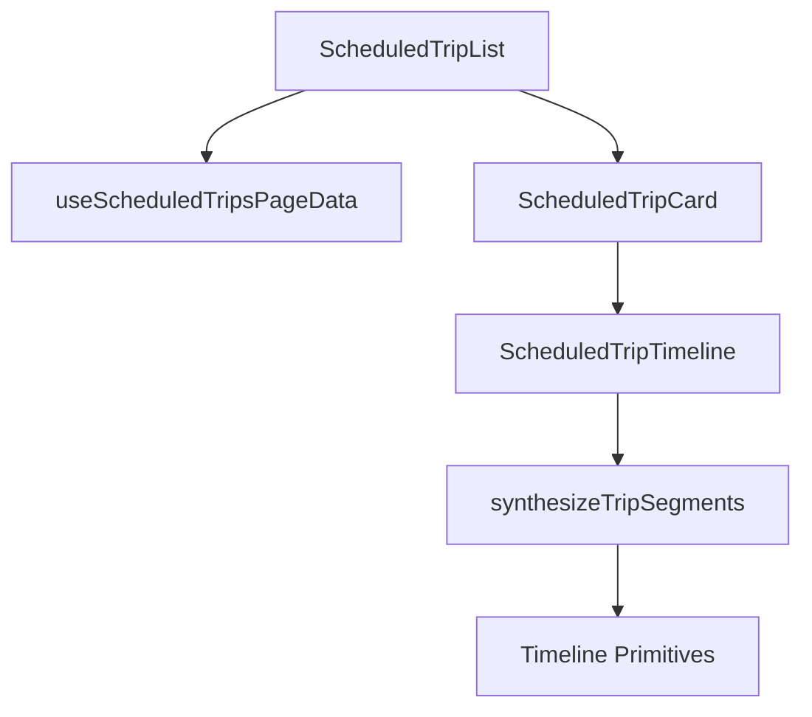

# ScheduledTrips — Timeline Data Flow & Architecture

This feature renders **scheduled ferry journeys** (WSF schedule) as multi-leg timelines, optionally overlaying **actual / estimated** timing data from our real-time system.

## Data Flow Overview

The architecture follows a **Pull-Based Synthesis** model. Instead of pre-calculating a global display state for the entire page, each component resolves its own state by observing a unified "truth map" of real-time data.

### 1. Data Acquisition (`useScheduledTripsPageData`)
The entry point for data is the `useScheduledTripsPageData` hook. It coordinates three primary streams:
- **Schedule (Primary)**: Fetches raw scheduled trip rows from Convex. This is the "skeleton" of the page.
- **Real-time Overlay**: Fetches active and completed vessel trips.
- **Vessel State**: Fetches live vessel locations and hold-window data.

### 2. Physical Reconstruction (`reconstructJourneys`)
Raw schedule rows are flat. The client reconstructs them into `ScheduledTripJourney` objects by:
- Grouping segments by physical departure (terminal + time).
- Building chains by following `NextKey` pointers.
- Filtering by destination if requested.

### 3. Map Building (`useScheduledTripsMaps`)
A unified `vesselTripMap` is built with a strict precedence rule:
**Completed Trips** → **Active Trips** → **Held Trips (30s window)**.
The `Key` (deterministic scheduled trip ID) is the universal join key.

### 4. On-Demand Synthesis (`synthesizeTripSegments`)
As each `ScheduledTripCard` renders, it calls `synthesizeTripSegments`. This is where the "magic" happens. Each segment self-resolves its status, phase, and estimated times:
- **Status Determination**:
  - `past`: The `vesselTripMap` contains a record with a `TripEnd` for this segment's `Key`.
  - `ongoing`: The segment's `Key` matches the vessel's current `activeKey` (derived from `heldTrip` or `vesselLocation.ScheduledDeparture`).
  - `future`: Default state.
- **Phase Determination**:
  - `completed`: Status is `past`, or the segment is held and not ongoing (i.e. held after arrival). Ongoing segments never get `completed` phase, so the at-sea bar never shows "Arrived" while the vessel is en route, even when the trip is in the hold window.
  - `at-sea` / `at-dock`: Status is `ongoing`, resolved via `vesselLocation.AtDock` (held or not).
  - `pending`: Default state.
- **Estimated times for future segments**: For a segment with status `future`, estimated arrival at the segment's origin and estimated departure from that origin are pulled from the *previous* segment's `VesselTrip` via `segment.PrevKey`. This allows cards for the next leg (e.g. BBI → P52) to show "Arrive BBI" and "Leave BBI" estimates while the vessel is still on the current leg (e.g. P52 → BBI). See **Predictions** under Implementation Notes.

---

## Component Hierarchy

- **`ScheduledTripList`**: Manages the scrollable container and high-level loading/empty states.
- **`ScheduledTripCard`**: A presentational wrapper that provides the route header and passes data to the timeline.
- **`ScheduledTripTimeline`**: The functional core. It memoizes the synthesis results and maps them to low-level Timeline primitives (`TimelineBarAtDock`, `TimelineBarAtSea`, etc.).

---

## Key Concepts

### The Join Invariant
Every piece of real-time data is joined to the schedule via the `segment.Key`. If a `VesselTrip` does not have a `Key`, it is ignored. This prevents "phantom" indicators or data bleeding between unrelated trips.

### Exclusive Activity
Because the `activeKey` is derived from the vessel's authoritative state (`ScheduledDeparture` or `heldTrip`), only **one segment per vessel** can ever be `ongoing` across the entire application. This eliminates the need for complex global coordination.

### The 30s Hold Window
When a vessel arrives and the trip technically ends, we "hold" the trip identity for ~30 seconds. During this window:
1. The `heldTrip` provides the `activeKey`.
2. The `vesselLocation` is frozen to the arrival state.
3. The UI shows a "Held" state (pink bar) to give the user time to see the arrival before the card resets to the next scheduled trip.

---

## File Map

| File | Responsibility |
| :--- | :--- |
| `ScheduledTripList.tsx` | Entry component; handles layout and scrolling. |
| `useScheduledTripsPageData.ts` | Main data coordinator hook. |
| `useScheduledTripsMaps.ts` | Builds the unified `vesselTripMap` and location maps. |
| `utils/reconstructJourneys.ts` | Logic for turning flat rows into multi-leg chains. |
| `utils/synthesizeTripSegments.ts` | **Core Logic**: Maps raw data to the `TripSegment` view model. |
| `ScheduledTripTimeline.tsx` | Composes low-level timeline primitives. |

---

## Implementation Notes & Debugging

- **Missing Indicator**: Check if the `vesselLocation.ScheduledDeparture` matches the `segment.DepartingTime`. If they don't match exactly, the segment won't be marked as `ongoing`.
- **Wrong Status**: Verify the `vesselTripMap`. If a trip has a `TripEnd`, it will always be `past`.
- **"Arrived" while en route**: If the at-sea bar shows "Arrived" and "--" when the vessel is still at sea, the segment likely has `phase === "completed"` instead of `at-sea`. Ensure phase is only `completed` when status is `past` or when held and not ongoing (see Phase Determination above).
- **Predictions (future segments)**: For a *future* segment (e.g. BBI → P52 while the vessel is on P52 → BBI), estimated times are resolved from the previous segment's `VesselTrip` via `segment.PrevKey`. `arriveCurr.estimated` (arrival at this segment's origin) uses `vesselLocation.Eta`, then `prevTrip.AtSeaArriveNext?.PredTime`, then `prevTrip.AtDockArriveNext?.PredTime`. `leaveCurr.estimated` (departure from that origin) uses `prevTrip.AtDockDepartNext?.PredTime` or `prevTrip.AtSeaDepartNext?.PredTime`. This ensures the next leg's card shows projected arrival and departure at the connecting terminal.
