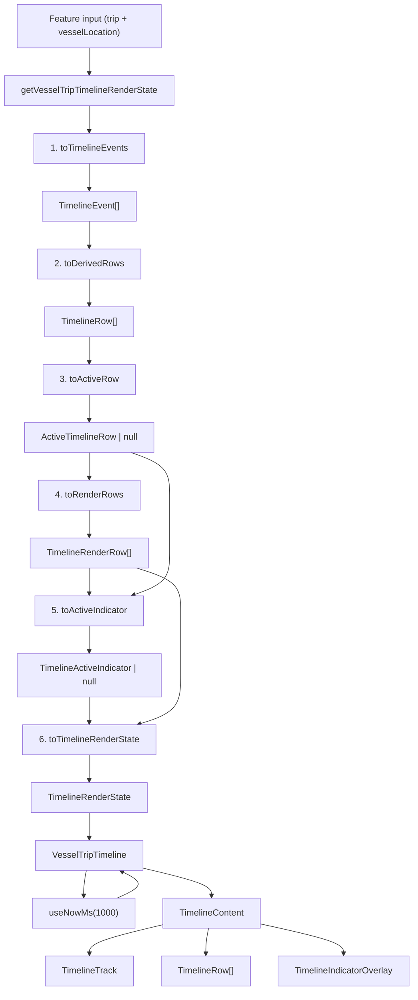

# Vessel Trip Timeline Layout Architecture

This document explains the current architecture for the compact
`VesselTripTimeline` card.

The feature keeps the working full-surface blur overlay and now models the
trip-card timeline as a strict single-input, single-output pipeline:

`events -> derived rows -> active row -> render rows -> indicator`

Shared renderer primitives still live in `src/components/timeline`. Trip-card
timeline semantics stay local to `src/features/VesselTripTimeline`.

## High-Level Flow

Callers use a single entry point:
`getVesselTripTimelineRenderState(item, getTerminalNameByAbbrev, now?)`.

That entry point runs the feature-local pipeline internally and returns only
`TimelineRenderState`.



## Render Pipeline (`renderPipeline/`)

The pipeline is a literal chain: each stage accepts the previous stage's output
and returns the next enriched value.

| Stage | Module | Input | Output |
|-------|--------|-------|--------|
| 1 | `toTimelineEvents.ts` | `TimelinePipelineInput` | `TimelinePipelineWithEvents` |
| 2 | `toDerivedRows.ts` | `TimelinePipelineWithEvents` | `TimelinePipelineWithRows` |
| 3 | `toActiveRow.ts` | `TimelinePipelineWithRows` | `TimelinePipelineWithActiveRow` |
| 4 | `toRenderRows.ts` | `TimelinePipelineWithActiveRow` | `TimelinePipelineWithRenderRows` |
| 5 | `toActiveIndicator.ts` | `TimelinePipelineWithRenderRows` | `TimelinePipelineWithActiveIndicator` |
| 6 | `toTimelineRenderState.ts` | `TimelinePipelineWithActiveIndicator` | `TimelineRenderState` |

The entry point `renderPipeline/index.ts` runs these stages in order and
exports `getVesselTripTimelineRenderState`.

## Core Feature Model

The feature's internal truth is split into small, explicit pipeline outputs
instead of a single "document" abstraction.

### Ordered events

`toTimelineEvents.ts` builds an ordered `TimelineEvent[]` from the current trip
and live vessel location.

Each `TimelineEvent` contains:

- `eventType`: `"arrive"` or `"depart"`
- `terminalAbbrev`
- `timePoint`

The event list is ordered. It does not need extra concepts like
`origin`/`destination`, dock indexes, or persisted IDs.

### Derived rows

`toDerivedRows.ts` derives `TimelineRow[]` from adjacent ordered event pairs.

Each `TimelineRow` contains:

- `rowId`
- `kind`: `"at-dock"` or `"at-sea"`
- `startEvent`
- `endEvent`
- `geometryMinutes`
- `fallbackDurationMinutes`
- `progressMode`: `"time"` or `"distance"`

Row kinds are positional:

- `arrive -> depart` becomes an `at-dock` row
- `depart -> arrive` becomes an `at-sea` row

There is no separate backend truth for rows. They are a feature-local
derivation.

### Active row

`toActiveRow.ts` selects the current `ActiveTimelineRow | null`.

That selection is local render-state plumbing. It is not a domain-level row
cursor that other features need to share.

### Render rows

`toRenderRows.ts` maps feature-local rows into the shared timeline renderer's
row shape.

That stage owns renderer-specific concerns:

- compact labels
- compact terminal display names
- marker appearance
- final-row flags

### Active indicator

`toActiveIndicator.ts` derives the overlay indicator from the selected active
row plus the current trip item and local clock.

It owns:

- time-vs-distance progress choice
- countdown label text
- subtitle content
- animation enablement

## Geometry vs Current State

The pipeline separates stable geometry from current-state presentation.

### Geometry-owned stages

- `toTimelineEvents.ts` owns actual / estimated / scheduled precedence
- `toDerivedRows.ts` owns row ordering, fallback durations, geometry minutes,
  and progress mode defaults

### Current-state stages

- `toActiveRow.ts` owns which row currently owns the overlay
- `toRenderRows.ts` owns marker appearance and display copy
- `toActiveIndicator.ts` owns the overlay position and banner content

That keeps `TimelineContent.tsx` focused on layout and rendering instead of
trip-state decisions.

## Renderer + Overlay

After the pipeline, the UI layer is:

- `VesselTripTimeline.tsx`
  - owns a local `useNowMs(1000)` clock so the indicator keeps moving even when
    live backend data is quiet
  - passes `new Date(nowMs)` into `getVesselTripTimelineRenderState`
- `components/TimelineContent.tsx`
  - receives render-ready rows and the active indicator
  - measures row bounds
  - renders the shared timeline primitives
  - paints one absolute overlay indicator above the whole timeline

The blur requirement is the main layout constraint.

The active indicator can overlap adjacent rows, so it cannot live inside just
one row. The feature keeps one normal timeline layer and one absolute overlay
layer:

```text
View (timeline container)
└── BlurTargetView
    ├── TimelineTrack (absolute, full height)
    ├── shared TimelineRow[]
    │   └── leftContent | center-marker | rightContent
    └── TimelineIndicatorOverlay (absolute inset-0)
        └── TimelineIndicator
```

The track and overlay share the same boundary notion:

`topPx = rowLayout.y + rowLayout.height * clamp(positionPercent, 0, 1)`

- rows report measured `y` and `height` through `onRowLayout`
- `toActiveIndicator.ts` decides which row owns the overlay and what
  `positionPercent` to use
- `TimelineTrack` draws completed and remaining bars from the same computed
  boundary position
- `TimelineIndicatorOverlay` renders exactly one indicator at that position

## Row Presentation Rules

Each row shows one set of labels and one marker: its start boundary.

The row still keeps both `startEvent` and `endEvent` for geometry and progress,
but display copy is anchored to the start side of the row.

The feature still renders three rows for the compact trip card:

1. current dock interval
2. at-sea interval
3. next dock interval

The final row has `isFinalRow: true`, so it can render without a flex-grown
height.

## Indicator Rules

`toActiveRow.ts` owns row-selection rules:

- `trip.AtDockDepartNext?.Actual` means the timeline is complete
- destination-side closure (see `getDestinationArrivalOrCoverageClose` in
  `TimelineFeatures/shared/utils/tripTimeHelpers.ts`) moves the active row to
  the final dock row
- departure evidence (`trip.LeftDockActual`, `trip.LeftDock`, or
  `vesselLocation.LeftDock`) moves the active row to the sea row
- otherwise the first dock row remains active

`toActiveIndicator.ts` owns overlay-progress rules:

- completed timelines pin the indicator to `1`
- at-dock rows use time-based progress from row boundary times
- at-sea rows prefer distance-based progress when both live distances are
  usable
- distance progress uses
  `DepartingDistance / (DepartingDistance + ArrivingDistance)`
- if live distances are unavailable, at-sea rows fall back to time-based
  progress
- the first dock row applies a small minimum offset (`0.06`) so the active
  overlay does not sit directly on top of the static marker

## Shared Timeline UX Boundary

`src/components/timeline` is the shared renderer layer.

That shared module owns:

- measurable row shells
- row content layout and marker geometry
- track rendering
- indicator rendering and overlay positioning helpers
- shared theme constants
- generic UI-facing timeline types used only by the shared renderer

`VesselTripTimeline` still owns:

- the event-first trip-card render pipeline in `renderPipeline/`
- compact terminal and label copy
- trip-specific overlay subtitle text
- time-vs-distance indicator rules
- the fixed-height trip-card layout
- the decision to compose the shared primitives inside
  `components/TimelineContent.tsx`

## Important Constraints

- `BlurTargetView` wraps the full timeline for Android blur support
- `TimelineIndicatorOverlay` uses `pointerEvents="none"` so interactions are
  not blocked
- the overlay must share the same positioned ancestor as the measured rows
- the indicator renders only after the active row has measured bounds
- terminal abbreviations remain canonical inside the feature pipeline and are
  translated to compact display names only in the renderer-facing stage

## Documentation Boundary

This document should stay separate from
`src/features/VesselTimeline/docs/ARCHITECTURE.md`.

The two features share the renderer vocabulary in `src/components/timeline`,
but they do not share the same feature pipeline or business rules.
