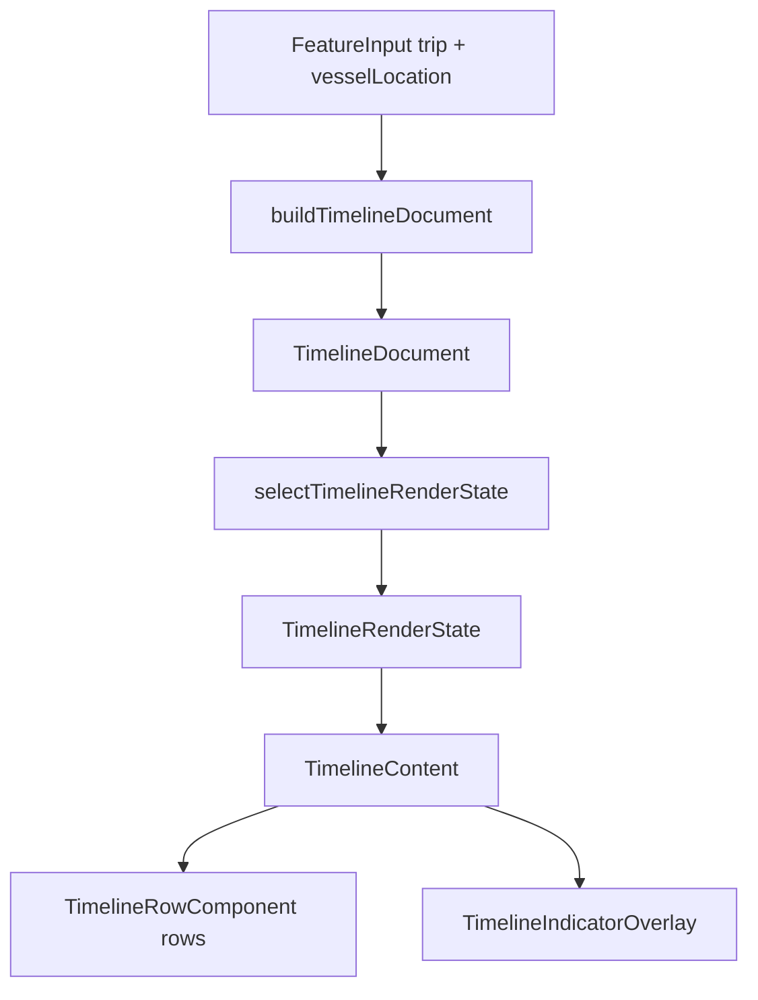

# Vessel Trip Timeline Layout Architecture

This document explains the current architecture for the vessel trip timeline.
The feature keeps the working full-surface blur overlay, but now uses a slimmer
two-step pipeline built on top of shared generic timeline document/selector
primitives. That makes it easier to extend into a future multi-stop day
timeline without duplicating ordered-row mechanics per feature.

## High-Level Flow



## Canonical Document Model

The feature's source of truth is now a `TimelineDocument` built by
`utils/buildTimelineDocument.ts`.

The base document and render-state shapes live in
`src/components/Timeline/TimelineDocument.ts`, while `VesselTripTimeline`
supplies feature-specific boundary payloads, progress modes, labels, and
telemetry rules.

The document contains:

- ordered `rows`
- one `activeSegmentIndex` cursor

Each `TimelineDocumentRow` contains:

- `id`
- `segmentIndex`
- `kind`: `"at-dock"` or `"at-sea"`
- `startBoundary` / `endBoundary`
- `boundaryOwnership`
- `geometryMinutes`
- `fallbackDurationMinutes`
- `progressMode`: `"time"` or `"distance"`
- `layoutMode`: `"duration"` or `"content"`

Adjacent rows still share boundary `TimePoint`s, but the feature no longer
creates a second presentation-row model on top of the canonical document.

## Two-Step Pipeline

The feature now splits into two pure data stages plus one renderer:

1. **Canonical document builder**
   - `utils/buildTimelineDocument.ts`
   - Builds the ordered day/timeline rows from trip and vessel-location data.
   - Computes geometry minutes and explicit boundary ownership up front.

2. **Render-state selector**
   - `utils/selectTimelineRenderState.ts`
   - Derives:
     - row `percentComplete`
     - start/end boundary labels
     - active overlay indicator `{ rowId, rowIndex, positionPercent, label }`
   - Owns the feature-specific "what is active right now?" logic.
   - Reuses shared selector helpers for active-row lookup, row phase, and
     row completion.

3. **Renderer + overlay**
   - `components/TimelineContent.tsx`
   - Receives render-ready rows and the active indicator.
   - Measures row bounds.
   - Renders the shared timeline rows in background mode.
   - Paints one absolute indicator overlay above the whole timeline.

## Why the Overlay Stays

The blur requirement is the main architectural constraint.

The active indicator can overlap adjacent rows, so rendering it inside just the
active row is not sufficient. Instead, the feature keeps one normal timeline
layer and one absolute overlay layer:

```text
View (timeline container)
└── BlurTargetView
    ├── TimelineRowComponent[]
    │   └── leftContent | axis | rightContent
    └── TimelineIndicatorOverlay (absolute inset-0)
        └── TimelineIndicator
```

The overlay does not duplicate rows. Instead:

- rows report measured `y` and `height` through `onRowLayout`
- the selector decides which row owns the active indicator
- row-local `positionPercent` is converted into container-relative `top`
- the overlay renders exactly one indicator above the full timeline

Indicator position is:

`rowLayout.y + rowLayout.height * positionPercent`

## Geometry vs Current State

The architecture now cleanly separates:

### Canonical geometry

- row ordering
- shared boundaries
- fallback durations
- progress mode
- layout mode

### Current render state

- active row
- per-row completion
- boundary label tense
- countdown label
- active indicator position

This keeps `TimelineContent` focused on layout and rendering instead of feature
business logic.

## Boundary Ownership

Boundary ownership is now explicit on each document row.

- Every row owns its starting boundary.
- Rows may also own their ending boundary through `boundaryOwnership.end`.
- The destination dock row uses `layoutMode: "content"` so it can own the final
  boundary without forcing duration-based growth.

This replaces the older `rendersEndLabel` and `minHeight: 0` special cases with
row-level semantics.

## Shared Timeline Primitive Boundary

`src/components/Timeline` remains domain-agnostic.

The shared module now owns:

- generic document/render-state types
- active-row lookup
- lifecycle phase derivation
- row percent-complete derivation

`VesselTripTimeline` still owns:

- trip/vessel document building
- boundary label copy
- time-vs-distance progress choice
- overlay label content
- blur-specific overlay rendering

For now, `VesselTripTimeline` intentionally renders `TimelineRowComponent`
directly instead of going through the higher-level `VerticalTimeline` API.
That is a deliberate choice:

- the feature needs row measurement
- the feature owns a full-surface overlay indicator
- the current public primitive API does not expose that overlay workflow cleanly

This keeps the shared primitive generic while letting `VesselTripTimeline`
manage its feature-specific blur overlay locally.

## Indicator State Rules

`selectTimelineRenderState.ts` owns the current-state rules:

- `activeSegmentIndex` points at the active row
- `rows.length` means all rows are completed
- at-sea rows prefer distance-based progress when telemetry is available
- otherwise progress is time-based from the row boundary `TimePoint`s
- the first active dock row applies a small minimum offset (`0.06`) so the
  indicator does not sit directly on top of the static marker

## Indicator Position Animation

`positionPercent` still updates infrequently from Convex data. To avoid visible
jumps:

- `hooks/useAnimatedProgress.ts` animates the indicator's absolute `top` value
  with a Reanimated spring
- `TimelineIndicator.tsx` applies the animated `top` via `useAnimatedStyle`

Animation runs on the UI thread, so the indicator remains smooth even when the
backing data updates only every few seconds.

## Important Constraints

- `BlurTargetView` wraps the full timeline for Android blur support.
- `TimelineIndicatorOverlay` uses `pointerEvents="none"` so interactions are not
  blocked.
- The overlay must share the same positioned ancestor as the measured rows.
- The indicator renders only after the active row has measured bounds.
- Terminal abbreviations remain canonical in the document model and are only
  translated to display names in the UI layer.
